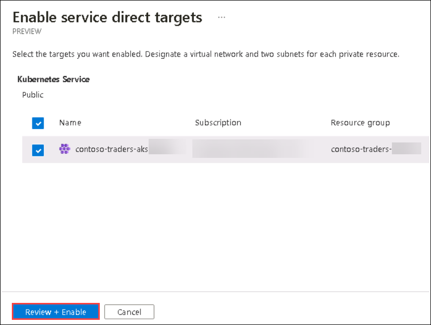
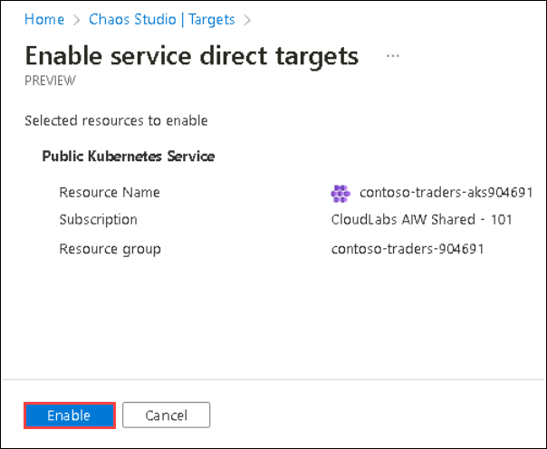
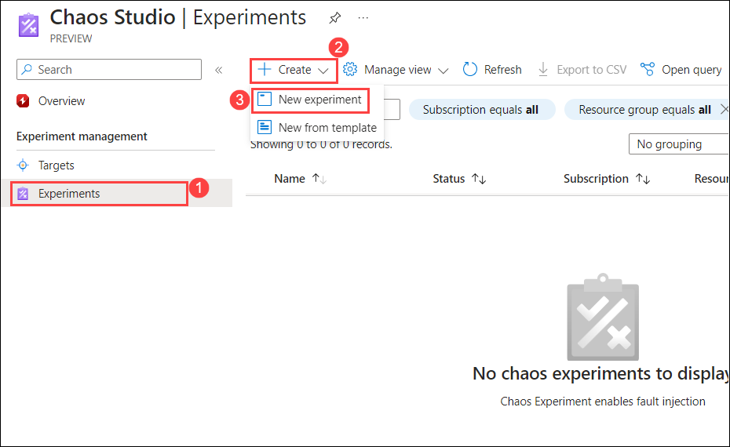
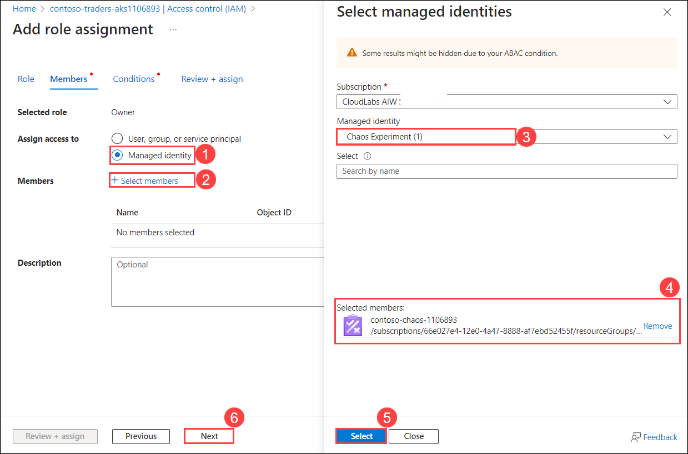
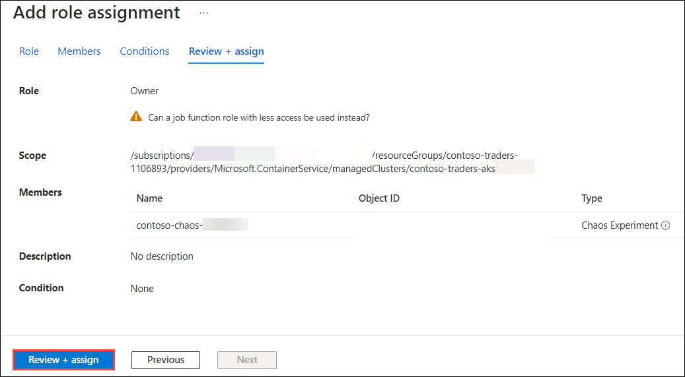

# Challenge 05: Resilience Testing using Azure Chaos Studio

## Introduction

This challenge centers around Azure Load Testing and Azure Chaos Studio, empowering you to perform performance tests and enhance application resilience. In the modern digital landscape, guaranteeing optimal performance during heavy loads and fortifying against disruptions is essential. Through Azure's tools, you'll gain insights into proactive issue detection and methods to reinforce your applications.

This is the solution guide that contains all of the comprehensive, step-by-step directions needed to finish the challenge.

## Solution Guide

## Task 1: Setting Up Azure Load Testing

In this task, you'll create an Azure Load Testing instance and run a test using a JMeter file.

1. In the Azure Portal, navigate to **contoso-traders-<inject key="Deploymentid" enableCopy="false" />** resource group and select the **Endpoint** resource with the name  **contoso-traders-ui2<inject key="Deploymentid" />**.

   

1. From the overview of **contoso-traders-ui2<inject key="Deploymentid" enableCopy="false" />** endpoint, copy the **Endpoint hostname** **(2)** and paste it into the notepad for later use in the task.

   

1. In the Azure Portal, navigate to **contoso-traders-<inject key="Deploymentid" enableCopy="false" />** **(1)** resource group and select the **Azure Load Testing** resource with the name  **contoso-traders-loadtest<inject key="Deploymentid" />** **(2)**.

   
   
1. On the left hand side pane, select **Tests** ***(1)*** and click on **+ Create** ***(2)*** and select **Create a quick test** ***(3)***.

   

1. On the **Create test** page, under basic tab paste the **Endpoint URL** as Test URL ***(1)*** and  leave everything as default, then click **Run Test** ***(2)***.

   

1. The test run will start running and once the test run is completed, you will be able to see **Client-side metrics**. Explore the given metrics output.

   
   
   **Note**: In case, the test fails due to `The test was stopped due to a high error rate. Check your script and try again. In case the issue persists, raise a ticket with a support error. This is expected as sometimes the load on the application exceeds the defined throughput.
     
## Task 2: Create experiment and target using Azure Chaos studio

In this task you will add **Targets** and create an **Experiment** on **Azure Chaos Studio** to check the resilience of the web application that we created by adding  real faults and observe how our applications respond to real-world disruptions.

1. In the Azure Portal search for **Azure Chaos Studio (1)** and then click on it from the search results **(2)**.
   
   

1. In the **Azure Chaos Studio**, select **Targets** on the left menu.

   
      
1. From the drop-down menu, select **contoso-traders-<inject key="DeploymentID" enableCopy="false" />** resource group.
 
   
     
1. Click on the **contoso-traders-aks<inject key="DeploymentID" enableCopy="false" />** **(1)** **Kubernetes service** instance and form the drop-down for **Enable Targets** **(2)** choose **Enable service-direct targets (All resources)** **(3)**.

   
     
1. Click on **Review + Enable**.

   

1. Then click on **Enable** to Enable service direct targets. 
   
   

1. Wait for the deployment to be completed.  

1. In the Azure Portal search for **Azure Chaos Studio** ***(1)*** and then click on it from the search results ***(2)***.
   
   
    
1. Once the target is enabled, select **Experiments** ***(1)*** on the left, click **+ Create** ***(2)*** drop-down, and select **New experiment** **(3)** .
 
   
 
1. On the **Create an experiment** page, under **Basics** tab provide the following values and select **Next: Permissions >** ***(4)***.

    - Subscription: Select the default subscription ***(1)***
    - Resource Group: **contoso-traders-<inject key="DeploymentID" enableCopy="false" />** ***(2)***
    - Name: **contoso-chaos-<inject key="DeploymentID" enableCopy="false" />** ***(3)***
    - Region: Leave it to default 
 
   
   
1. On the **Permissions** page, leave the default selection and select **Next: Experiment designer >**.

   
 
1. On the **Experiment designer** page select **+ Add action (1)** and choose **Add fault (2)**.

   
 
1. On the **Add fault** page, select the following and select **Next: Target resources>** **(4)**.
   
   - Faults: **AKS Chaos Mesh Pods Chaos** ***(1)***
   - Duration (minutes): **5** ***(2)***
   - jsonSpec: Leave it to default ***(3)***
     
   
     
1. On the **Target resources**, select the **Manually select from a list** **(1)** under **Select target resources** , select the **contoso-traders-aks<inject key="DeploymentID" enableCopy="false" />** ***(2)*** resource, and **Add** ***(3)***.
  
   
  
1. Click on **Review + create**.
  
   
   
1. On the **Review + create** click on **Create**.
  
   
  
1. Navigate back to the **contoso-traders-aks<inject key="DeploymentID" enableCopy="false" />** container instance and select **Access control (IAM) (1)**, click on **+ Add (2)** and select **Add role assignment (3)**. 
  
   
  
1. In the **Add role assignment** page, under **Role** tab select **Privileged administrator roles**. Select **Owner (1)** in it and then **Next (2)**.
  
   
  
1. Next on the **Members** tab select **Managed identity (1)**  for **Assign access to** , click on **+ Select members (2)**  on the **Select managed identities** choose **Chaos Experiment (3)** for **Managed identity** select the experiment **contoso-chaos-<inject key="DeploymentID" enableCopy="false" /> (4)**, click on **Select (5)** and click on **Next** **(6)**.  
   
   
  
1. Next on the **Conditions** tab select **Delegation type** as **Not constrained** **(1)** and click on **Review + assign** **(2)**.

   

1. Click on **Review + assign**. 
   
   
      
1. On the Azure portal navigate back to the Chaos experiment you created **contoso-chaos-<inject key="DeploymentID" enableCopy="false" />** and click on **Start**.
  
   
 
1. Select **Ok** for **Start this experiment** pop-up.

    
       
1. Once the experiment status is **Success** click on **Details** to view the run preview.
 
   
 
1. On the **Details** preview page select **Action (1)** and view the complete detail of the run on **Fault details** under **Successful targets (2)**.
 
   

## Success criteria:
To complete this challenge successfully:

- Successful integration of Azure Monitor and Application Insights within the application environment, ensuring seamless data collection and monitoring capabilities.
- Selection and configuration of key performance metrics relevant to the application's functionality and performance goals.
- Establishment of effective alerting mechanisms with well-defined thresholds, ensuring timely notifications for potential issues or deviations in monitored metrics.

## Additional Resources:

- Refer to [Continuous validation with Azure Load Testing and Azure Chaos Studio](https://learn.microsoft.com/en-us/azure/architecture/guide/testing/mission-critical-deployment-testing) for reference.
- [What is Azure Chaos Studio?](https://learn.microsoft.com/en-us/azure/chaos-studio/chaos-studio-overview).
- [Load test a website by using a JMeter script in Azure Load Testing](https://learn.microsoft.com/en-us/azure/load-testing/how-to-create-and-run-load-test-with-jmeter-script?tabs=portal).
- [Intro to Chaos Engineering and Azure Chaos Studio](https://pdtit.medium.com/intro-to-chaos-engineering-and-azure-chaos-studio-preview-5e85fff10642).
