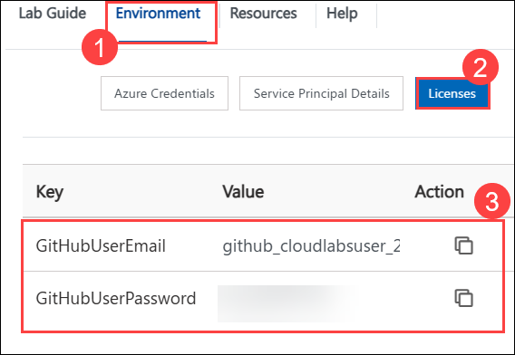
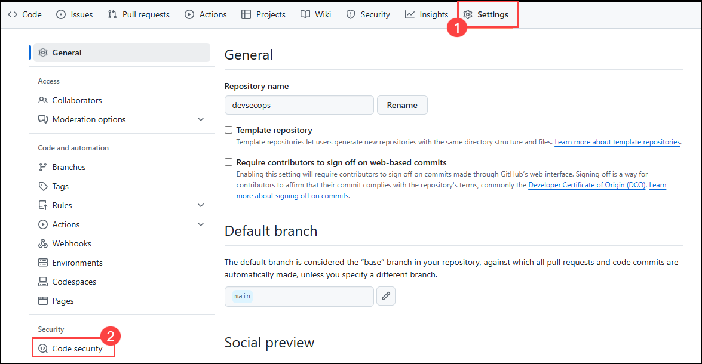
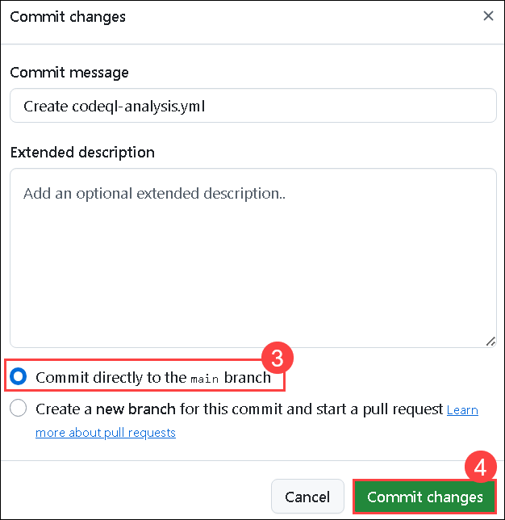
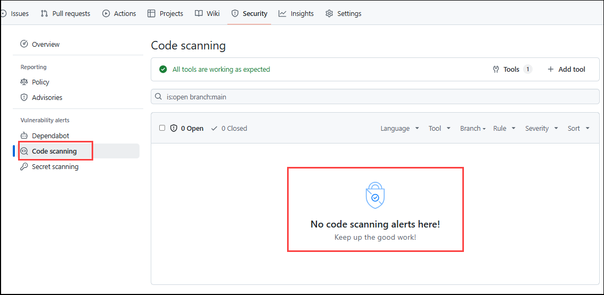
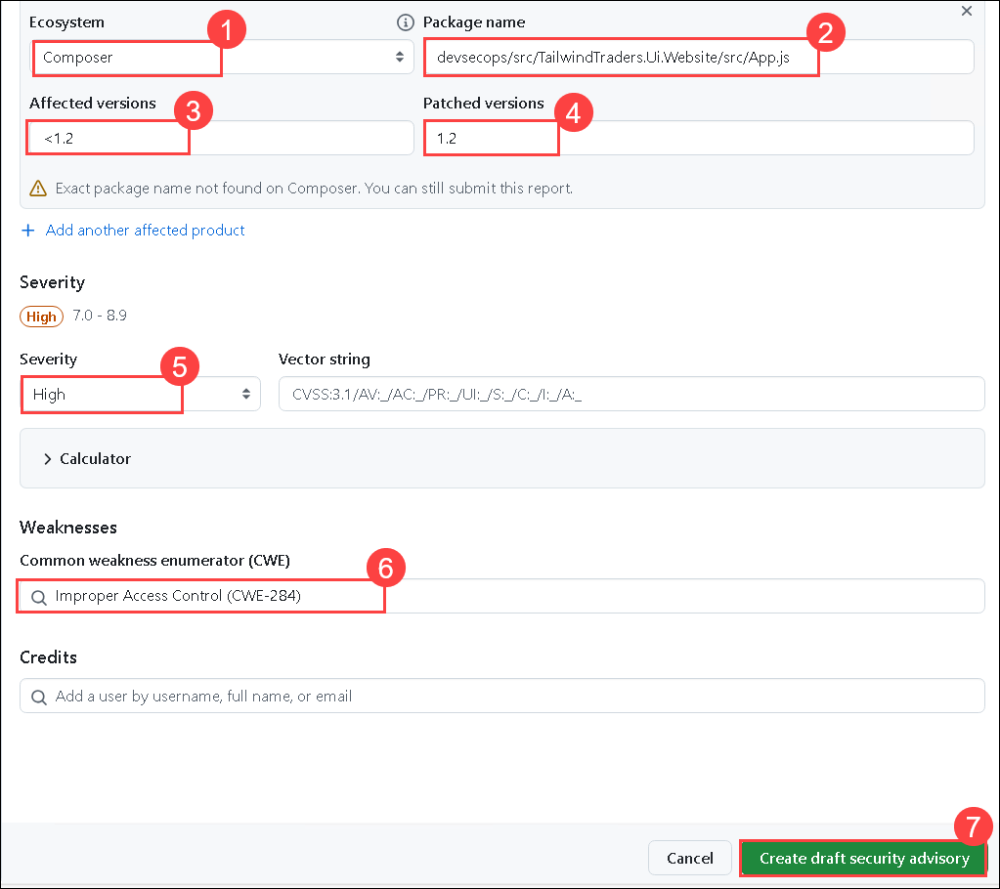
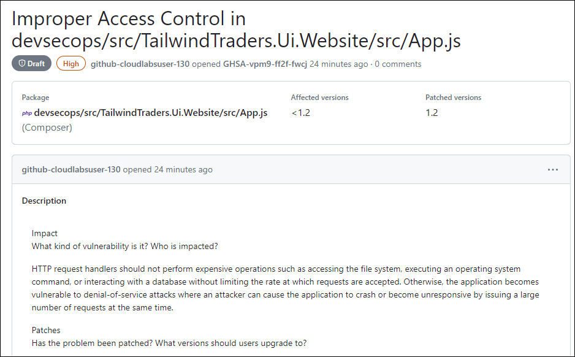

# Challenge 02: GitHub Advanced Security - Implement Code Security Enhancements

## Introduction
In this challenge, the user will focus on implementing security features such as Code scanning, CodeQL alerts, and repository security advisories to their GitHub repository using GitHub Advance security features.

Here's the solution guide, which includes detailed step-by-step instructions required to complete this challenge.

## Accessing GitHub

1. To access and log into GitHub, open the edge browser from inside the environment and navigate to **[GitHub](https://github.com/)**.

2. Sign in to GitHub by clicking on the **Sign in** button in the top right corner of the GitHub home page.

3. On the **Sign into GitHub tab**, you will see a login screen. Enter the following `GitHubUserEmail` and `GitHubUserPassword` then click on **Sign in**.

    >**Note**: For **GitHubUserEmail** and **GitHubUserPassword**, Navigate to **Environment(1)**, click on **Licenses (2)** and Copy **(3)**.
            
     

## Solution Guide

## Task 1: Implement Code Scanning and CodeQL:

In this task, you'll configure Code scanning and explore CodeQL alerts. Code scanning is a feature that you use to analyze the code in a GitHub repository to find security vulnerabilities and coding errors. Any problems identified by the analysis are shown on GitHub.

**Note**: To perform this task, the GitHub repository should be public. If the repository visibility is private, please go to the settings of the repository and change the visibility to public.
   
1. Select the **Settings** ***(1)*** tab from the GitHub browser tab. Click on **Code security** ***(2)*** under the security side blade.

     
   
1. Click on the **Set up** **(1)** button to enable CodeQL analysis, and select the **Advanced** **(2)** option for creating a CodeQL Analysis YAML file.

         

1. Update the workflow name to **codeql-analysis.yml** ***(1)*** and review the yaml file. Select **Commit changes** ***(2)***, then select **Commit directly to the main branch** ***(3)***, and click on **Commit changes** ***(4)***.
  
   

    
  
1. Navigate to the **Actions** ***(1)*** tab, here you can review the **workflow** ***(2)*** run.
    
    
  
1. Navigate to the **Security** ***(1)*** tab and click on **View alerts** ***(2)***.
   
   
  
1. You will be navigated to the **Code scanning** section. You'll be able to visualize the **No code scanning alerts here!**.
   
   
    
## Task 2: Implement Repository security advisories:
 
In this task, you'll enable Repository security advisories. You can use GitHub Security Advisories to privately discuss, fix, and publish information about security vulnerabilities in your repository.  Anyone with admin permissions to a repository can create a security advisory.
 
1. Navigate to the **Security** ***(1)*** tab, select **Advisories** ***(2)*** from the side blade, and click on **New draft security advisory** ***(3)***.

     
     
1. In the Open a draft security advisory tab, under the Advisory Details section, provide the following details:

   - Title: **Improper Access Control in devsecops/src/ContosoTraders.Ui.Website/src/App.js** ***(1)***
   - CVE identifier: **Request CVE ID later** ***(2)***
   - Description: **Add** ***(3)*** replace the below-mentioned details in the description section.
   
   ```
   Impact
   What kind of vulnerability is it? Who is impacted?

   HTTP request handlers should not perform expensive operations such as accessing the file system, executing an operating system command, or interacting with a database without limiting the rate at which requests are accepted. Otherwise, the application becomes vulnerable to denial-of-service attacks where an attacker can cause the application to crash or become unresponsive by issuing a large number of requests at the same time.

   Patches
   Has the problem been patched? What versions should users upgrade to?

   It is patched and rectified the error. Please use 1.2 version

   Workarounds
   Is there a way for users to fix or re../mediate the vulnerability without upgrading?

   // set up rate limiter: maximum of five requests per minute
   var RateLimit = require('express-rate-limit');
   var limiter = new RateLimit({
   windowMs: 1601000, // 1 minute
   max: 5
   });

   // apply rate limiter to all requests
   app.use(limiter);

   Added the above code in app.js

   References
   Are there any links users can visit to find out more?

   https://github.com/OWASP/API-Security/blob/master/2019/en/src/0xa4-lack-of-resources-and-rate-limiting.md
   https://codeql.github.com/codeql-query-help/javascript/js-missing-rate-limiting/
   ```
    
   
   
1. In the **Affected products** section, provide the following details and click on **Create draft security advisory** ***(7)***   
 
   - Ecosystem: **composer** ***(1)***
   - Package name: **devsecops/src/TailwindTraders.Ui.Website/src/App.js** ***(2)***
   - Affected version: **<1.2** ***(3)***
   - Patched version: **1.2** ***(4)***
   - Severity: **High** ***(5)***
   - Common Weakness Enumerator (CWE): **Improper Access Control (CWE-284)** ***(6)***
  
     
   
 1. Once the security advisory is created, scroll down and click on **start a temporary private fork**. It is used to collaborate on a patch for this advisory.

    
    
    
  
 1. After having the temporary fork, you can request a CVE. It is used for GitHub reviews and published security advisories. Upon review, we may use this advisory to send Dependabot alerts to affected repositories and redistribute the advisory through our API and Atom feed.

 ## Success criteria:
To complete this challenge successfully:

   - Verify the implementation of Implement Code Scanning and CodeQL.
   - Configure the Repository security advisories feature and create temporary private fork.

## Additional Resources:

- Refer to [About GitHub's Advanced Security](https://docs.github.com/en/code-security/getting-started/github-security-features) for reference.
- Refer to [About GitHub's Advanced Security](https://docs.github.com/en/code-security/code-scanning/introduction-to-code-scanning/about-code-scanning-with-codeql) for reference.
- Refer to [Code Scanning with GitHub CodeQL](https://learn.microsoft.com/en-us/training/modules/code-scanning-with-github-codeql/) for reference.
