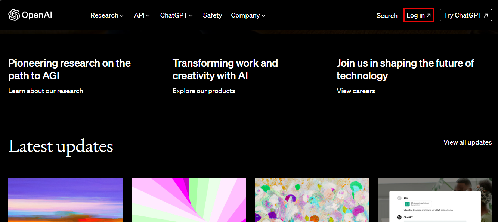
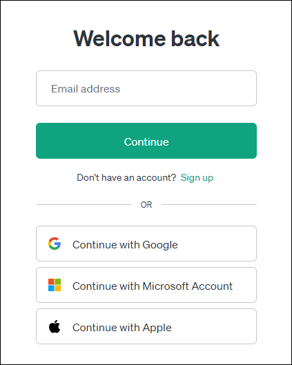
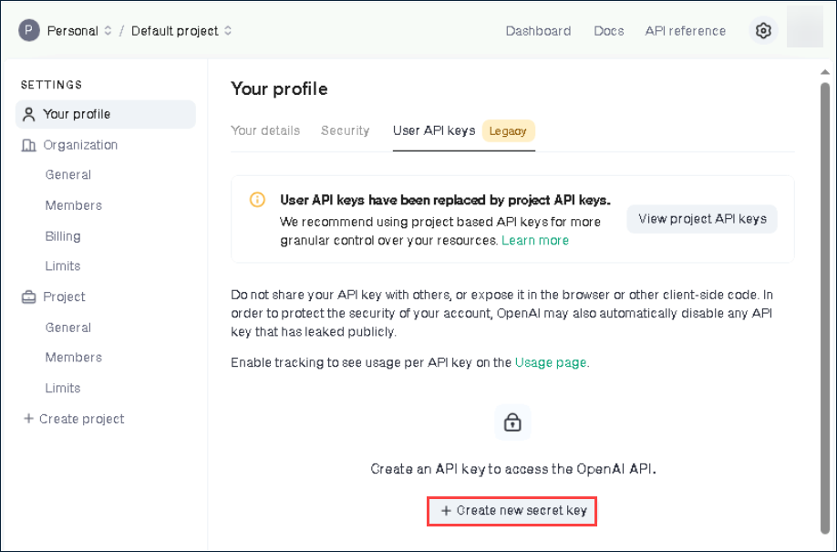
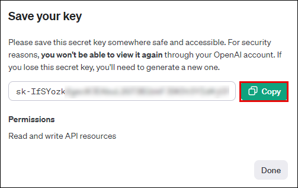
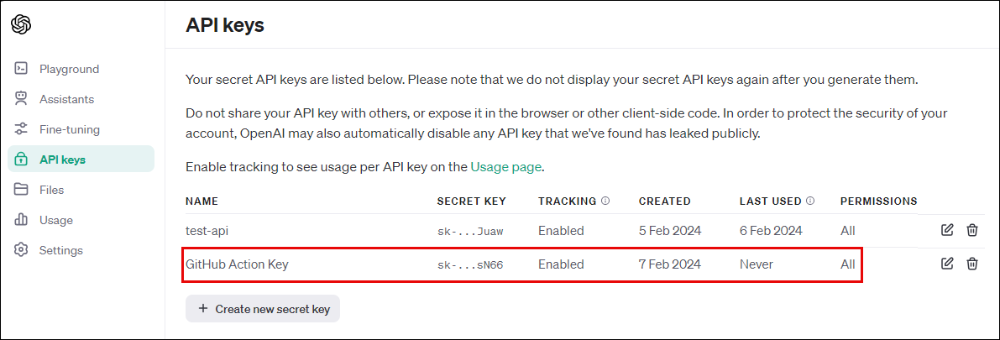
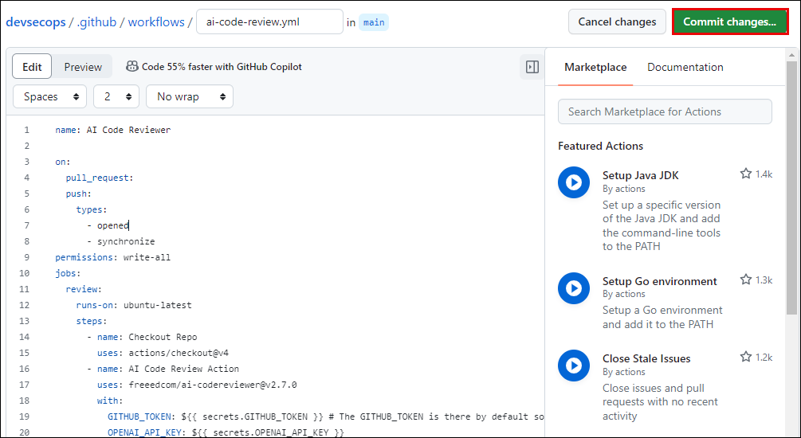
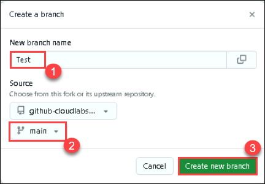
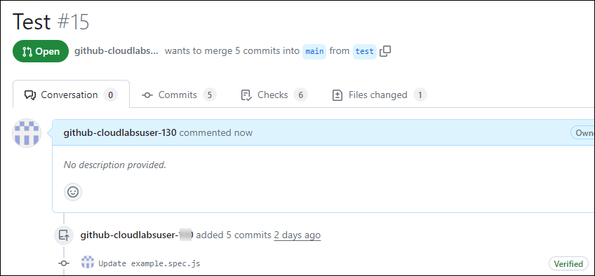

# Challenge 06: DevSecOps with AI-Powered GitHub Actions

## Introduction

Contoso Traders, an e-commerce platform, is committed to delivering secure and efficient software solutions. In this challenge, as a Lead DevSecOps engineer, your focus is to enhance the DevSecOps workflow by leveraging AI-driven GitHub Actions that focus on code review and security checks for pull requests thus leading to improved code quality and enhanced security practices in the development lifecycle.

You need to focus on completing the implementation of the below-mentioned GitHub Actions:

**AI Code Review Action**: AI Code Reviewer is a GitHub Action that leverages OpenAI's GPT-4 API to provide intelligent feedback and suggestions on your pull requests.
**AI Security Check for Pull Request**: This GitHub Action uses OpenAI's GPT to analyse code in pull requests and identify potential security and privacy vulnerabilities and comment to the pull request with the findings.

Here is the solution guide, which provides all the specific, step-by-step directions needed to do the task.

## Accessing GitHub

1. To access and log into GitHub, open the edge browser from inside the environment and navigate to **[GitHub](https://github.com/)**.

2. Sign in to GitHub by clicking on the **Sign in** button in the top right corner of the GitHub home page.

3. On the **Sign into GitHub tab**, you will see a login screen. Enter the following email/username, and then click on **Next**.

   - **Email/Username:** <inject key="GitHubUsername"></inject>

1. Now enter the following password and click on **Sign in**.

   - **Password:** <inject key="GitHubPassword"></inject>

## Solution Guide

## Exercise 1: Configure and implement AI Code Review GitHub Action

### Task 1: Sign In/Sign Up to an OpenAI Account

1. Navigate to the **[OpenAI](https://openai.com/)** and click on **Log in**.

   

2. Within the **Welcome back** page,
    - If you already have an OpenAI account pre-created, you can go ahead signing into OpenAI using the following sign in options as shown in the below screenshot.

      

      >**Note:** Ensure that your OpenAI account has active credits for the generation and usage of API keys.

    - If you are new to OpenAI and do not have an account created, click on **Sign up** within the *Welcome back* page to create a new free-tier account. 

      

      >**Note:** Upon creation of a new OpenAI account, the free-tier provides you with a $5 credit limit that expires within a period of 3 months from the day of account activation.

### Task 2: Create an OpenAI secret key

1. Once you have successfully logged into your OpenAI account, you will be auto directed to the overview page of the OpenAI platform. If not, you can navigate to the OpenAI platform using the following link, **[OpenAI platform](https://platform.openai.com/docs/overview)**.

    

2. Hover your cursor over the left navigation tool bar to expand the pane and click on **API keys**.

    

3. Within the **API keys** page, click on **+ Create new secret key**.

    

4. On the **Create new secret key** pop-up, configure the following:
    - **Name:** `GitHub Action Key` **(1)**
    - **Permissions:** Select `All` **(2)**
    - Click on **Create Secret key (3)**

    

5. Upon creation of a new secret, save your key by clicking on the **Copy** button and pasting it on your notepad for a handy access.

    **Note:** For safety reasons, **you won't be able to view the secret value again** once the **Save your key** page is closed.

    

6. You wil now notice that the new API key, `GitHub Action Key` now appears in the lest of **API keys**.

    

### Task 3: Create a new GitHub repository secret

1. Sign in to GitHub using the credentials provided in the environment detail tab of the integrated lab environment or via the credentaials provided at the beginning of this solution guide.

2. Select the `devops` repository that was created as a part of the earlier challenges.

3. Under **Security**, expand **Secrets and variables** **(1)** by clicking the drop-down and select **Actions** **(2)** blade from the left navigation bar. Select the **New repository secret** **(3)** button.

   

4. Under the **Actions Secrets/New secret** page, enter the below-mentioned details and click on **Add secret** **(3)**.

   - **Name** : Enter **OPENAI_API_KEY** **(1)**
   - **Value** : Paste the OpenAI secret value that was copied earlier over to the notepad **(2)**.

   

### Task 4: Configure the AI Code Review GitHub Action

1. Login to GitHub and select the `devops` repository that was created as a part of the earlier challenges.

2. Select the **Actions (1)** tab from your repository home page and then click on **New Workflow (2)**.

   

3. On the Get Started with GitHub Actions page, select **set up a workflow yourself**.

   

4. In the text box, enter the name `ai-code-review.yml` for your workflow file.

   

5. Copy and paste the following action workflow into the Edit new file tab:

    ```
    name: AI Code Reviewer
    
    on:
      pull_request:
        types:
          - opened
          - synchronize
    permissions: write-all
    jobs:
      review:
        runs-on: ubuntu-latest
        steps:
          - name: Checkout Repo
            uses: actions/checkout@v3
    
          - name: AI Code Reviewer
            uses: your-username/ai-code-reviewer@main
            with:
              GITHUB_TOKEN: ${{ secrets.GITHUB_TOKEN }} # The GITHUB_TOKEN is there by default so you just need to keep it like it is and not necessarily need to add it as secret as it will throw an error. [More Details](https://docs.github.com/en/actions/security-guides/automatic-token-authentication#about-the-github_token-secret)
              OPENAI_API_KEY: ${{ secrets.OPENAI_API_KEY }}
              OPENAI_API_MODEL: "gpt-4" # Optional: defaults to "gpt-4"
              exclude: "**/*.json, **/*.md" # Optional: exclude patterns separated by commas
    ```

6. Commit the changes made to create the workflow file.

   

7. Click on **Commit new file**.

   

### Task 5: Create a pull request to intiate workflow

1. To create a new branch, click on the **Switch branch (1)** dropdown menu and click on **View all branches (2)**.
  
   

2. Click on **New branch** within the **Branches** page.

   

3. Within the **Create a branch** pop-up, enter the following:
   - **New branch name:** Test **(1)**
   - **Source:** Select `main` **(2)**.
   - Click on **Create new branch (3)**

   

4. Navigate to the newly created `Test` branch.

5. Create a Pull request to merge the changes made from the `test` to  `main` branch.

   

6. Click on the **Actions** tab and then notice that `AI Code Reviewer` workflow has been autoautomatically intiated. Ensure that the workflow does not fail. If so, there may be some vulnerabilities in the code within the recent pull request.  

   

## Exercise 2: Configure and implement AI Security Check for Pull Requests

### Task 1: Create a new GitHub repository secret

1. Sign in to GitHub using the credentials provided in the environment detail tab of the integrated lab environment or via the credentaials provided at the beginning of this solution guide.

2. Select the `devops` repository that was created as a part of the earlier challenges.

3. Under **Security**, expand **Secrets and variables** **(1)** by clicking the drop-down and select **Actions** **(2)** blade from the left navigation bar. Select the **New repository secret** **(3)** button.

   

4. Under the **Actions Secrets/New secret** page, enter the below-mentioned details and click on **Add secret** **(3)**.

   - **Name** : Enter **OPENAI_TOKEN** **(1)**
   - **Value** : Paste the OpenAI secret value that was created and copied over to the notepad in the previous exercise. **(2)**.

   

### Task 2: Configure GitHub Action

1. Login to GitHub and select the `devops` repository that was created as a part of the earlier challenges.

2. Select the **Actions (1)** tab from your repository home page and then click on **New Workflow (2)**.

   

3. On the Get Started with GitHub Actions page, select **set up a workflow yourself**.

   

4. In the text box, enter the name `ai-security-check-for-pr.yml` for your workflow file.

   

5. Copy and paste the following action workflow into the Edit new file tab:

   ```
   name: AI Security Check for Pull Requests
   
   on:
     pull_request:
       branches:
         - main
   
   jobs:
     ai_security_check_for_pull_requests:
       runs-on: ubuntu-latest
   
       steps:
         - name: Check out repository
           uses: actions/checkout@v2
   
         - name: Set up Node.js
           uses: actions/setup-node@v2
           with:
             node-version: 16
   
         - name: Install dependencies
           run: npm ci
   
         - name: Finding security and privacy code vulnerabilities
           id: ai_security_check
           uses: obetomuniz/ai-security-check-for-pull-requests-action@v1.0.0
           env:
             GH_TOKEN: ${{ secrets.GH_TOKEN }}
             GH_REPOSITORY: ${{ github.repository }}
             GH_EVENT_PULL_REQUEST_NUMBER: ${{ github.event.number }}
             OPENAI_TOKEN: ${{ secrets.OPENAI_TOKEN }}
   
         - name: Comment on pull request
           uses: actions/github-script@v6
           env:
             PR_COMMENT: ${{ steps.ai_security_check.outputs.pr_comment }}
           with:
             github-token: ${{ secrets.GH_TOKEN }}
             script: |
               const prComment = process.env.PR_COMMENT || "No security or privacy issues found.";
               const { data } = await github.rest.issues.createComment({
                 issue_number: context.issue.number,
                 owner: context.repo.owner,
                 repo: context.repo.repo,
                 body: prComment
               });
   ```

6. Commit the changes made to create the workflow file.

7. Click on **Commit new file**.

   

8. Navigate to the newly created `Test` branch.

9. Create a Pull request to merge the changes made from the `test` to  `main` branch.

10. Click on the **Actions** tab and then notice that `AI Security Check for Pull Requests` workflow has been autoautomatically intiated. Ensure that the workflow does not fail. If so, there may be some vulnerabilities within the recent pull request.  

   

## Success criteria:
To complete this challenge successfully:

- Appropriate integration and configuration of Microsoft Security DevOps GitHub Action.
- Successful connection of GitHub environment to Microsoft Defender for Cloud.

## Additional Resources:

- Refer to [Overview of Microsoft Defender for Cloud DevOps Security](https://learn.microsoft.com/en-us/azure/defender-for-cloud/defender-for-devops-introduction) for reference.
- Refer to [Configure the Microsoft Security DevOps GitHub action](https://learn.microsoft.com/en-us/azure/defender-for-cloud/github-action) for reference.
- Refer to [Connect your GitHub Environment to Microsoft Defender for Cloud](https://learn.microsoft.com/en-us/azure/defender-for-cloud/quickstart-onboard-github) for reference.
