# Challenge 06: DevSecOps with AI-Powered GitHub Actions

## Introduction

Contoso Traders, an e-commerce platform, is committed to delivering secure and efficient software solutions. In this challenge, as a Lead DevSecOps engineer, your focus is to enhance the DevSecOps workflow by leveraging AI-driven GitHub Actions that focus on code review and security checks for pull requests thus leading to improved code quality and enhanced security practices in the development lifecycle.

You need to focus on completing the implementation of the below-mentioned GitHub Actions:

**AI Code Review Action**: AI Code Reviewer is a GitHub Action that leverages OpenAI's GPT-4 API to provide intelligent feedback and suggestions on your pull requests.
**AI Security Check for Pull Request**: This GitHub Action uses OpenAI's GPT to analyse code in pull requests and identify potential security and privacy vulnerabilities and comment to the pull request with the findings.

Here is the solution guide, which provides all the specific, step-by-step directions needed to do the task.

## Accessing GitHub

1. To access and log into GitHub, open the edge browser from inside the environment and navigate to **[GitHub](https://github.com/)**.

2. Sign in to GitHub by clicking on the **Sign in** button in the top right corner of the GitHub home page.

3. On the **Sign into GitHub tab**, you will see a login screen. Enter the following email/username, and then click on **Next**.

   - **Email/Username:** <inject key="GitHubUsername"></inject>

4. Now enter the following password and click on **Sign in**.

   - **Password:** <inject key="GitHubPassword"></inject>

## Solution Guide

## Exercise 1: Configure and implement AI Code Review GitHub Action

### Task 1: Sign In/Sign Up to an OpenAI Account

1. Navigate to the **[OpenAI](https://platform.openai.com/login?launch)** in order to login to **OpenAI Account.**
   
3. Within the **Welcome back** page,
    - If you already have an OpenAI account pre-created, you can go ahead signing into OpenAI using the following sign-in options as shown in the below screenshot.

      

      >**Note:** Ensure that your OpenAI account has active credits for the generation and usage of API keys.

    - After providing the user email and password, you will be prompted to select an access option. Choose **API** to proceed.

      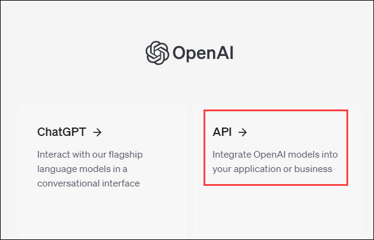
      
    - If you are new to OpenAI and do not have an account created, click on **Sign up** within the *Welcome back* page to create a new free-tier account. 

      
  
    - After clicking Sign Up on the welcome page:

        - Enter your email address – You can use your GitHub **Email address (1)** and click on **Continue (2)**.

          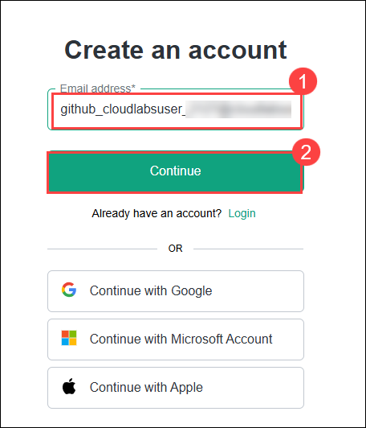

        - Enter your password – Use your GitHub **Password (1)** and click on **Continue (2).**
     
          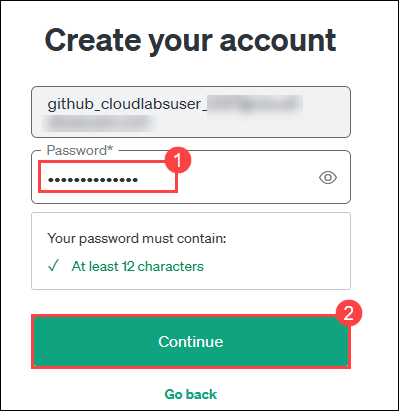
  
          >**Note:** You can find the GitHub credentials from the Environment Details page of the integrated lab environment, navigate to License tab.
  
        - A page will appear with the message "Verify your email". open http://outlook.office.com/ in a private window, provide the Github username and password, open the email from OpenAI, and click the verification link inside to complete the setup process. 
     
          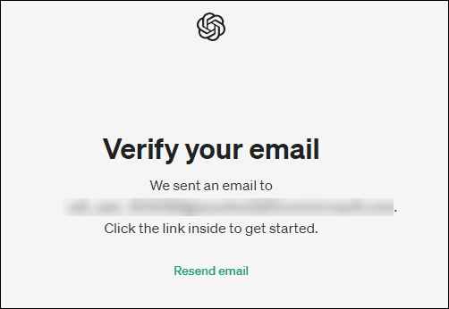
  
        - Navigate back to the login page provide Github username and password, You will be prompted to provide details like **Full Name** and **Date of Bith** then click on **Agree** this will navigate you the Open AI Platform.

      >**Note:** Upon creation of a new OpenAI account, the free tier provides you with a $5 credit limit that expires within a period of 3 months from the day of account activation.

### Task 2: Create an OpenAI secret key

1. Once you have successfully logged into your OpenAI account, you will be auto-directed to the overview page of the OpenAI platform. If not, you can navigate to the OpenAI platform using the following link, **[OpenAI platform](https://platform.openai.com/docs/overview)**.

1. Go to the profile icon in the top right corner and select **Your profile**.
   
    

2. Hover your cursor over the left navigation toolbar to expand the pane and click on **API keys**.

    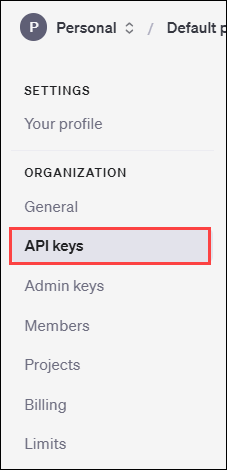

3. In order to create **API key**, its required to Verify it with your phone number.Click on **Start verification.**

   

4. Provide your Phone Number and click on **Send code.**

   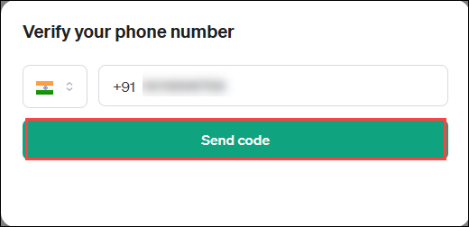

5. Enter the Verification code that has been sent to the Phone number.

   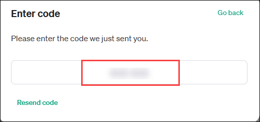

8. On the **Create new secret key** pop-up, configure the following:
   
    - **Name:** `GitHub Action Key` **(1)**
    - **Project:** Select **Default project (2)** from the drop down.
    - **Permissions:** Select `All` **(3)**
    - Click on **Create secret key (4)**

      

10. Upon creation of a new secret, save your key by clicking on the **Copy** button and pasting it on your notepad for a handy access.

    **Note:** For safety reasons, **you won't be able to view the secret value again** once the **Save your key** page is closed.

    

11. You will now notice that the new API key, `GitHub Action Key` now appears in the list of **API keys**.

    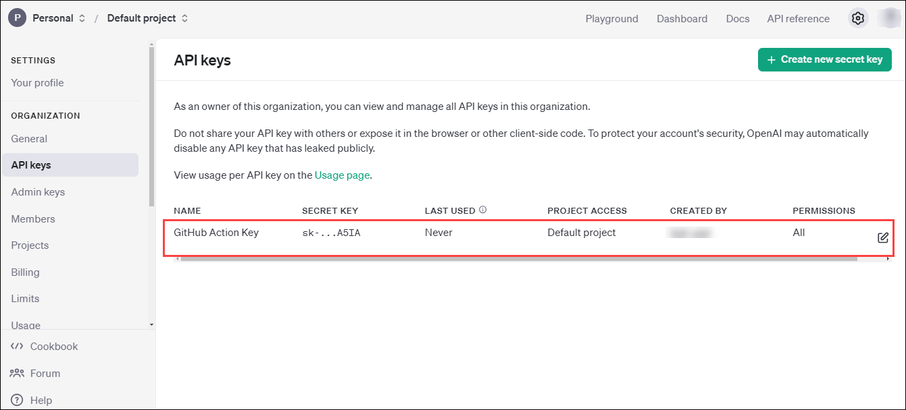

### Task 3: Create a new GitHub repository secret

1. Sign in to GitHub using the credentials provided in the environment detail tab of the integrated lab environment or via the credentials provided at the beginning of this solution guide.

2. Select the `devsecops` repository that was created as a part of the earlier challenges.

3. Under **Settings (1)**, expand **Secrets and variables** **(2)** under **security** by clicking the drop-down and select **Actions** **(3)** blade from the left navigation bar. Select the **New repository secret** **(4)** button.

   

4. Under the **Actions Secrets/New secret** page, enter the below-mentioned details and click on **Add secret** **(3)**.

   - **Name** : Enter **OPENAI_API_KEY** **(1)**
   - **Value**: Paste the OpenAI secret value that was copied earlier over to the notepad **(2)**.

     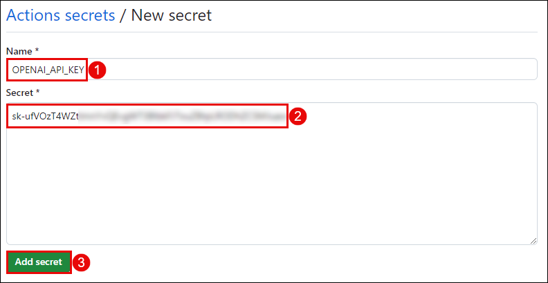

### Task 4: Configure the AI Code Review GitHub Action

1. Open a new tab and paste the below URL which will Navigate to the following repo and fork it.

   ```
   https://github.com/freeedcom/ai-codereviewer
   ```

   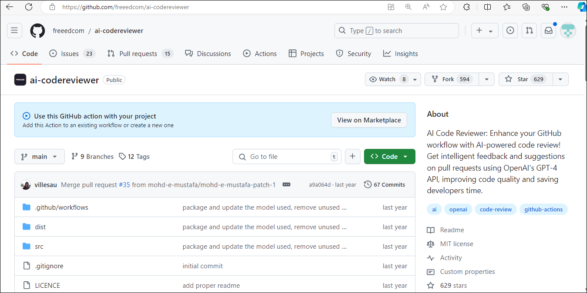
  
1. Click on **Fork (1)** and then select **Create a new fork (2).**

   

1. Uncheck **Copy the main branch only (1)** and click on **Create fork (2)**

   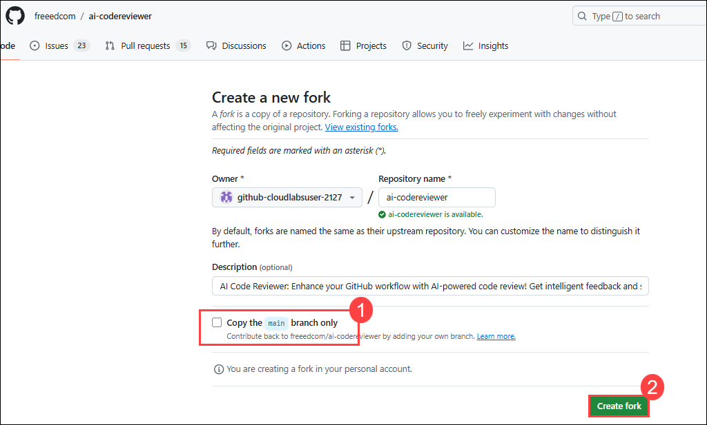
   
1. Click on **Settings** **(1)**, rename the repo name to **ai-code-reviewer** **(2)** and click on **Rename** **(3)** button. 

   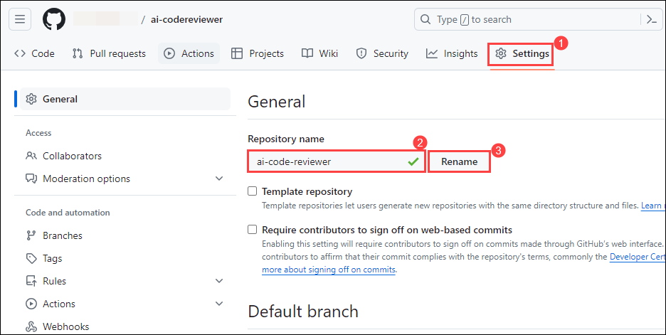

1. Navigate back to the `devsecops` repository that was created as a part of the earlier challenges.

   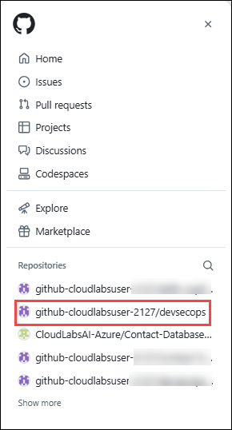

3. Select the **Actions (1)** tab from your repository home page and then click on **New Workflow (2)**.

   

4. On the Get Started with GitHub Actions page, select **set up a workflow yourself**.

   

5. In the text box, enter the name `ai-code-review.yml` for your workflow file.

   

6. Copy and paste the following action workflow into the Edit New file tab:

    ```
    name: AI Code Reviewer
    
    on:
      pull_request:
        types:
          - opened
          - synchronize
    permissions: write-all
    jobs:
      review:
        runs-on: ubuntu-latest
        steps:
          - name: Checkout Repo
            uses: actions/checkout@v3
    
          - name: AI Code Reviewer
            uses: your-username/ai-code-reviewer@main
            with:
              GITHUB_TOKEN: ${{ secrets.GITHUB_TOKEN }} # The GITHUB_TOKEN is there by default so you just need to keep it like it is and not necessarily need to add it as secret as it will throw an error. [More Details](https://docs.github.com/en/actions/security-guides/automatic-token-authentication#about-the-github_token-secret)
              OPENAI_API_KEY: ${{ secrets.OPENAI_API_KEY }}
              OPENAI_API_MODEL: "gpt-3.5"
              exclude: "**/*.json, **/*.md" # Optional: exclude patterns separated by commas
    ```

7. Rename `your-username` with a GitHub **username (1)** and Commit the changes made to create the workflow file by clicking on **Commit changes (2)**.

   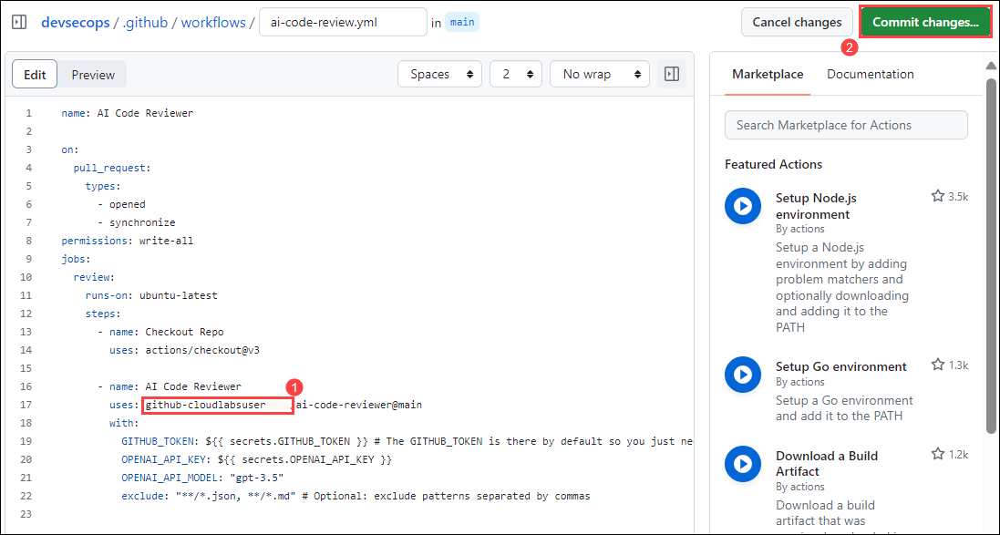

8. Click on **Commit changes**.

   

### Task 5: Create a pull request to initiate workflow

1. To create a new branch, click on the **Switch branch (1)** dropdown menu and click on **View all branches (2)**.
  
   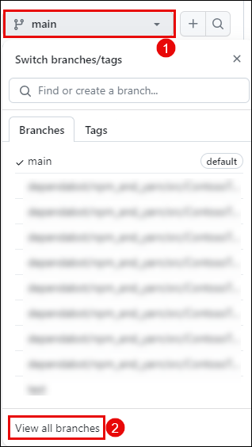

2. Click on **New branch** within the **Branches** page.

   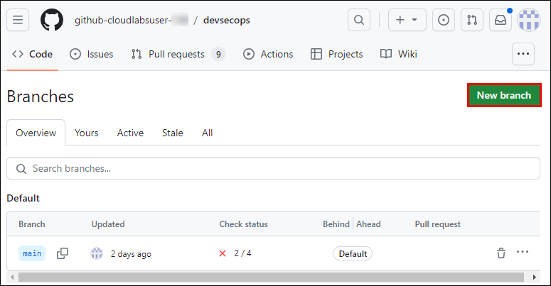

3. Within the **Create a branch** pop-up, enter the following:
   - **New branch name:** Test **(1)**
   - **Source:** Select `main` **(2)**.
   - Click on **Create new branch (3)**

     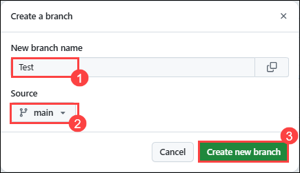

4. Navigate to the newly created `Test` branch.

   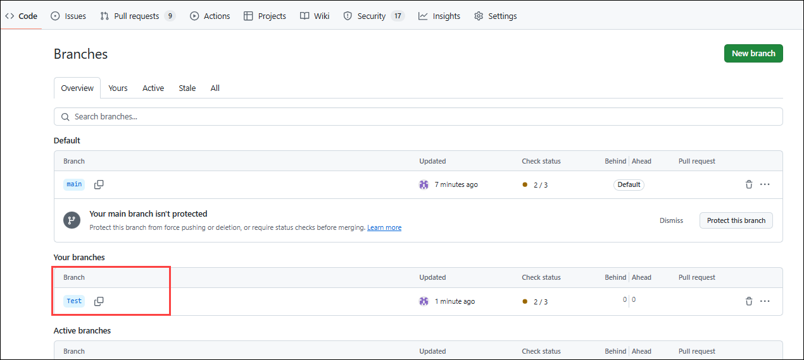

6. Select **.github (1)**, expand **workflows (2)** click on **ai-code-review.yml (3)**.

    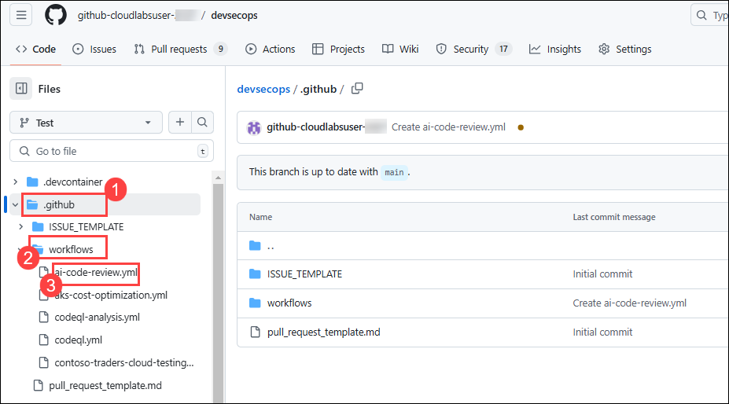

1. on the `ai-code-review.yml` file click on **pencil icon** at the top right corner in order to edit the file.

   

8. At the end of the line add a **space** or click on **enter** and click on **Commit changes.**

   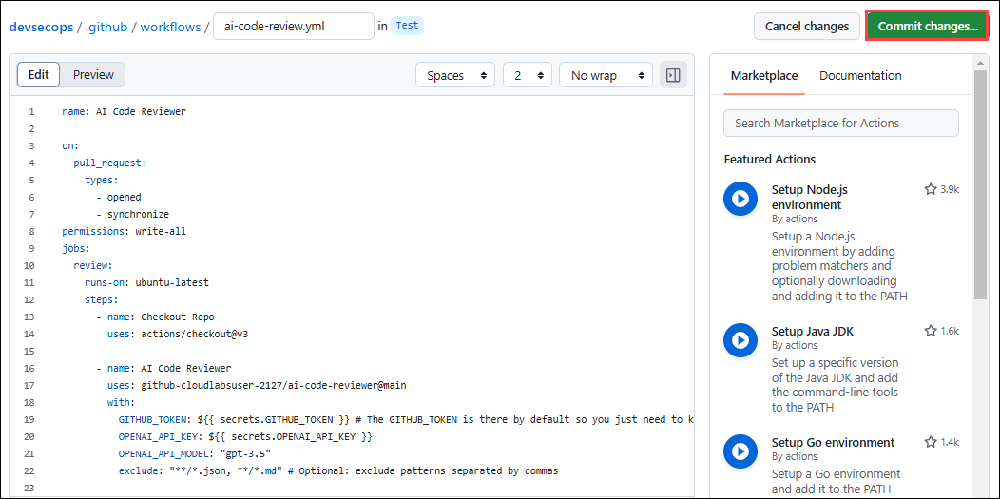

1. Click on **Commit changes.**

   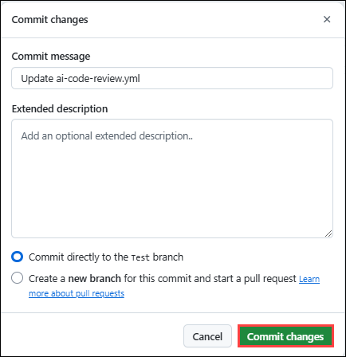

10. To Create a Pull request to merge the changes made from the `test` to  `main` branch. Click on **Pull requests**

    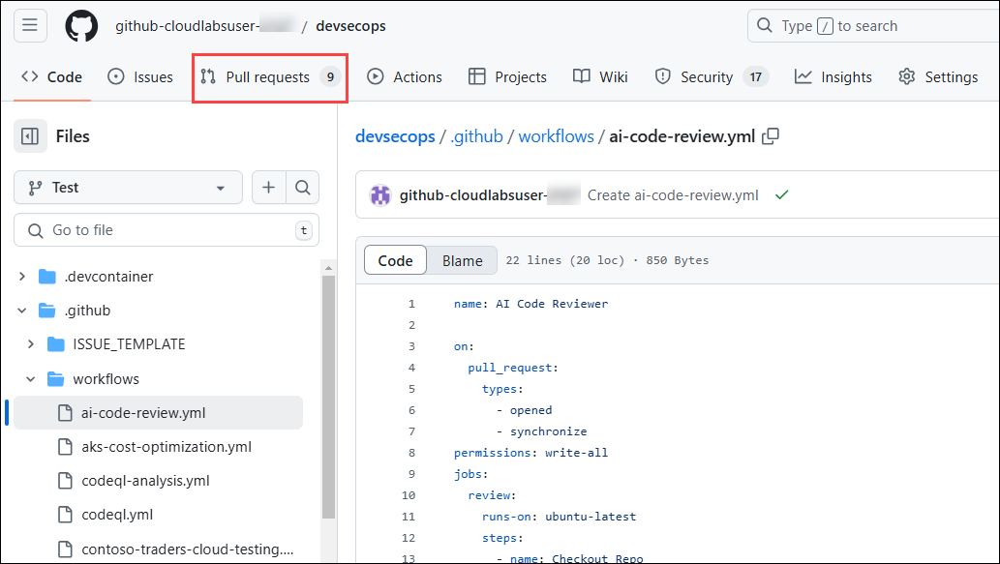

1. Click on **New pull request.**

   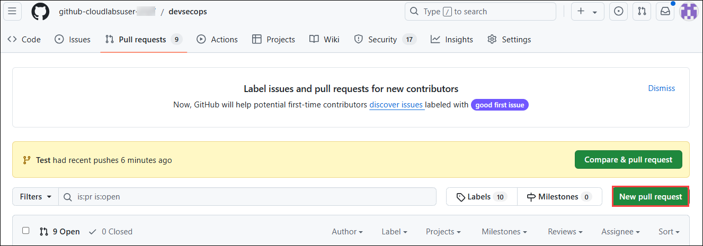

1. Here at the Comparing changes page, make sure you have selected **main (1)** for the base and **Test (2)** for compare , Then click on **Create pull request (3).**

   

1. Click on the **Actions** tab and then notice that `AI Code Reviewer` workflow has been automatically initiated. Ensure that the workflow does not fail. If so, there may be some vulnerabilities in the code within the recent pull request.  

   

## Exercise 2: Configure and implement AI Security Check for Pull Requests

### Task 1: Create a new GitHub repository secret

1. Sign in to GitHub using the credentials provided in the environment detail tab of the integrated lab environment or via the credentials provided at the beginning of this solution guide.

2. Select the `devsecops` repository that was created as a part of the earlier challenges.

3. Under **Security (1)**, expand **Secrets and variables** **(2)** by clicking the drop-down and select **Actions** **(3)** blade from the left navigation bar. Select the **New repository secret** **(4)** button.

   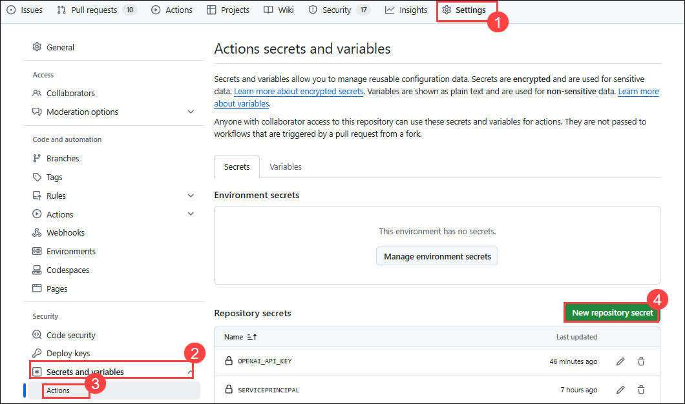

4. Under the **Actions Secrets/New secret** page, enter the below-mentioned details and click on **Add secret** **(3)**.

   - **Name** : Enter **OPENAI_TOKEN** **(1)**
   - **Value** : Paste the OpenAI secret value that was created and copied over to the notepad in the previous exercise. **(2)**.

     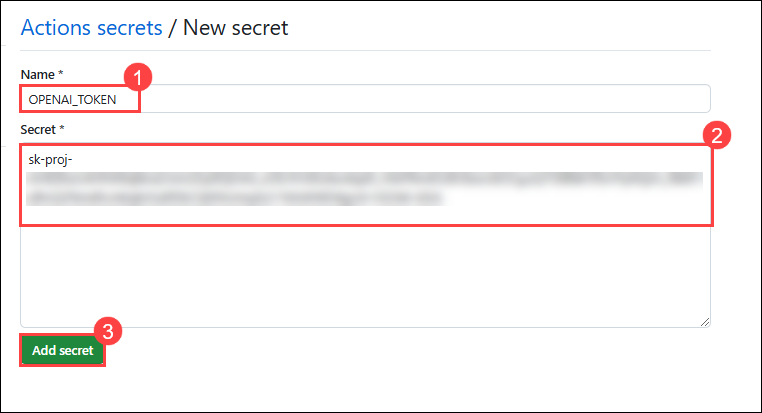

### Task 2: Configure GitHub Action

1. Login to GitHub and select the `devsecops` repository that was created as a part of the earlier challenges.

2. Select the **Actions (1)** tab from your repository home page and then click on **New Workflow (2)**.

   

3. On the Get Started with GitHub Actions page, select **set up a workflow yourself**.

   

4. In the text box, enter the name `ai-security-check-for-pr.yml` for your workflow file.

   

5. Copy and paste the following action workflow into the Edit new file tab:

   ```
   name: AI Security Check for Pull Requests
   
   on:
     pull_request:
       branches:
         - main
   
   jobs:
     ai_security_check_for_pull_requests:
       runs-on: ubuntu-latest
   
       steps:
         - name: Check out repository
           uses: actions/checkout@v2
   
         - name: Set up Node.js
           uses: actions/setup-node@v2
           with:
             node-version: 16
   
         - name: Install dependencies
           run: npm ci
   
         - name: Finding security and privacy code vulnerabilities
           id: ai_security_check
           uses: obetomuniz/ai-security-check-for-pull-requests-action@v1.0.0
           env:
             GH_TOKEN: ${{ secrets.GH_TOKEN }}
             GH_REPOSITORY: ${{ github.repository }}
             GH_EVENT_PULL_REQUEST_NUMBER: ${{ github.event.number }}
             OPENAI_TOKEN: ${{ secrets.OPENAI_TOKEN }}
   
         - name: Comment on pull request
           uses: actions/github-script@v6
           env:
             PR_COMMENT: ${{ steps.ai_security_check.outputs.pr_comment }}
           with:
             github-token: ${{ secrets.GH_TOKEN }}
             script: |
               const prComment = process.env.PR_COMMENT || "No security or privacy issues found.";
               const { data } = await github.rest.issues.createComment({
                 issue_number: context.issue.number,
                 owner: context.repo.owner,
                 repo: context.repo.repo,
                 body: prComment
               });
   ```

6. Commit the changes made to create the workflow file.

   

8. Click on **Commit changes**.

   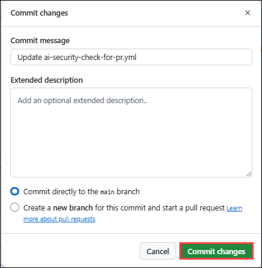

9. Navigate back to `Test` branch that you created.

   

11. Select `.github/workflows` and click on `ai-code-review.yml`.

12. At the end of the line add a **space** or click on **enter**. 

13. Create a Pull request to merge the changes made from the ` test ` to  ` main ` branch.

11. Click on the **Actions** tab and then notice that `AI Security Check for Pull Requests` workflow has been automatically initiated. Ensure that the workflow does not fail. If so, there may be some vulnerabilities within the recent pull request. Refer to the run details for the GitHub Actions that have failed.

    

## Success criteria:
To complete this challenge successfully:

- Successful implementation of the `AI Code Review Action` and generation of of review comments based on the AI's response and added to the pull request.
- Successful implementation of the `AI Security Check for Pull Requests` and generation of comments to the pull requests based on AI's analysis of the code.

## Additional Resources:

- Refer to [Overview of Microsoft Defender for Cloud devsecops Security](https://learn.microsoft.com/en-us/azure/defender-for-cloud/defender-for-devsecops-introduction) for reference.
- Refer to [Configure the Microsoft Security devsecops GitHub action](https://learn.microsoft.com/en-us/azure/defender-for-cloud/github-action) for reference.
- Refer to [Connect your GitHub Environment to Microsoft Defender for Cloud](https://learn.microsoft.com/en-us/azure/defender-for-cloud/quickstart-onboard-github) for reference.
