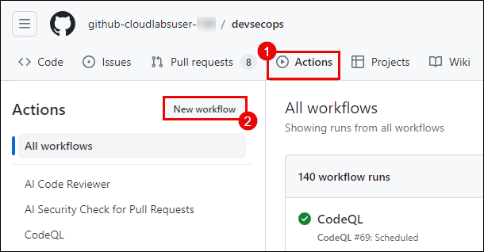
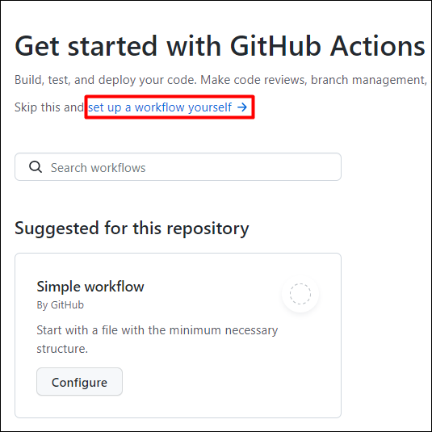
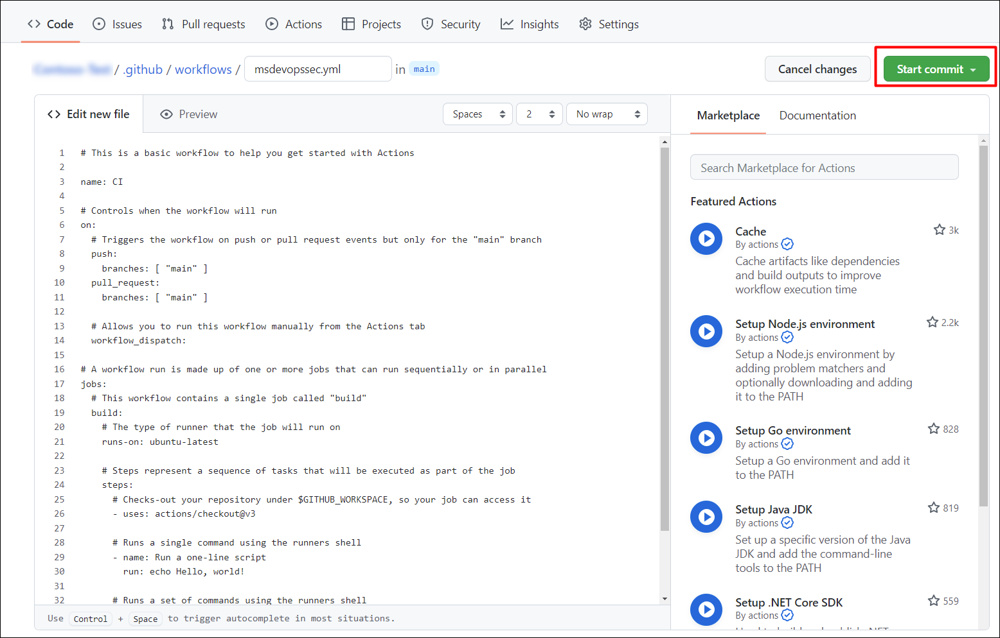

# Challenge 09: Implement Microsoft Defender for Cloud DevOps Security 

## Introduction

Contoso Traders, a leading trading platform, is committed to delivering secure and efficient software solutions. In this challenge, as a DevSecOps engineer, you are responsible for ensuring the security of your applications throughout the development lifecycle. Your organization has recently adopted Microsoft Defender for Cloud to enhance the security posture of your DevOps pipelines.

Your task is to implement Microsoft Defender for Cloud DevOps security measures by configuring the necessary GitHub actions within your created GitHub repository, viewing the scanned results, and connecting your GitHub environment to Microsoft Defender for Cloud.

This is the solution guide, which provides all the specific, step-by-step directions needed to do the task.

## Solution Guide

### Accessing the Azure Portal

1. To access the Azure Portal, open the Edge browser from inside the environment and navigate to the **[Azure Portal](https://portal.azure.com)**.

1. On the **Sign in to Microsoft Azure** tab, you will see a login screen. Enter the following email/username, and then click on **Next**. 
   * **Email/Username**: <inject key="AzureAdUserEmail"></inject>
        
1. Now enter the following password and click on **Sign in**.
   * **Password**: <inject key="AzureAdUserPassword"></inject>
     
1. If you see the pop-up **Stay Signed in?**, click No.

1. If you see the pop-up **You have free Azure Advisor recommendations!**, close the window to continue the lab.

1. If a **Welcome to Microsoft Azure** pop-up window appears, click **Maybe Later** to skip the tour.

## Task 1: Connect GitHub Environment to Microsoft Defender for Cloud

In this task, you will connect your GitHub organizations on the **Environment settings** page in Microsoft Defender for Cloud. This page provides a simple onboarding experience to auto-discover your GitHub repositories. By connecting your GitHub organizations to Defender for Cloud, you extend the security capabilities of Defender for Cloud to your GitHub resources.

   - **Foundational Cloud Security Posture Management (CSPM) features**: You can assess your GitHub security posture through GitHub-specific security recommendations.

   - Defender CSPM features: Defender CSPM customers receive code to cloud contextualized attack paths, risk assessments, and insights to identify the most critical weaknesses that attackers can use to breach their environment. Connecting your GitHub repositories will allow you to contextualize DevOps security findings with your cloud workloads and identify the origin and developer for timely remediation.

1. From your GitHub repository, click on the **Settings** tab.

   
    
### Task 2: Configure the Microsoft Security DevOps GitHub Action

Microsoft Security DevOps is a command line application that integrates static analysis tools into the development lifecycle. Security DevOps installs, configures, and runs the latest versions of static analysis tools such as, SDL, security and compliance tools. Security DevOps is data-driven with portable configurations that enable deterministic execution across multiple environments.

1. From the Azure Portal Dashboard, search for and select **Microsoft Defender for Cloud**

   

2. Select the `devops` repository that was created as a part of the earlier challenges.

3. Select the **Actions (1)** tab from your repository home page and then click on **New Workflow (2)**.

   

4. On the Get started with GitHub Actions page, select **set up a workflow yourself**.

   

5. In the text box, enter the name `.msdevopssec.yml` for your workflow file.

   

6. Copy and paste the following action workflow into the Edit new file tab:

  ```
  name: MSDO windows-latest
  on:
    push:
      branches:
        - main
  
  jobs:
    sample:
      name: Microsoft Security DevOps Analysis
  
      # MSDO runs on windows-latest.
      # ubuntu-latest also supported
      runs-on: windows-latest
  
      steps:
  
        # Checkout your code repository to scan
      - uses: actions/checkout@v3
  
        # Run analyzers
      - name: Run Microsoft Security DevOps Analysis
        uses: microsoft/security-devops-action@latest
        id: msdo
        with:
        # config: string. Optional. A file path to an MSDO configuration file ('*.gdnconfig').
        # policy: 'GitHub' | 'microsoft' | 'none'. Optional. The name of a well-known Microsoft policy. If no configuration file or list of tools is provided, the policy may instruct MSDO which tools to run. Default: GitHub.
        # categories: string. Optional. A comma-separated list of analyzer categories to run. Values: 'secrets', 'code', 'artifacts', 'IaC', 'containers. Example: 'IaC,secrets'. Defaults to all.
        # languages: string. Optional. A comma-separated list of languages to analyze. Example: 'javascript,typescript'. Defaults to all.
        # tools: string. Optional. A comma-separated list of analyzer tools to run. Values: 'bandit', 'binskim', 'eslint', 'templateanalyzer', 'terrascan', 'trivy'.
  
        # Upload alerts to the Security tab
      - name: Upload alerts to Security tab
        uses: github/codeql-action/upload-sarif@v2
        with:
          sarif_file: ${{ steps.msdo.outputs.sarifFile }}
  
        # Upload alerts file as a workflow artifact
      - name: Upload alerts file as a workflow artifact
        uses: actions/upload-artifact@v3
        with:  
          name: alerts
          path: ${{ steps.msdo.outputs.sarifFile }}
  ```

7. Select **Start Commit**.

   

8. Click on **Commit new file**.

   

9. Select **Actions** and verify the new action is running.

   

### Task 3: Configure the Microsoft Security DevOps GitHub Action

## Success criteria:
To complete this challenge successfully:

- Appropriate integration and configuration of Microsoft Security DevOps GitHub Action.
- Successful connection of GitHub environment to Microsoft Defender for Cloud.

## Additional Resources:

- Refer to [Overview of Microsoft Defender for Cloud DevOps Security](https://learn.microsoft.com/en-us/azure/defender-for-cloud/defender-for-devops-introduction) for reference.
- Refer to [Configure the Microsoft Security DevOps GitHub action](https://learn.microsoft.com/en-us/azure/defender-for-cloud/github-action) for reference.
- Refer to [Connect your GitHub Environment to Microsoft Defender for Cloud](https://learn.microsoft.com/en-us/azure/defender-for-cloud/quickstart-onboard-github) for reference.
